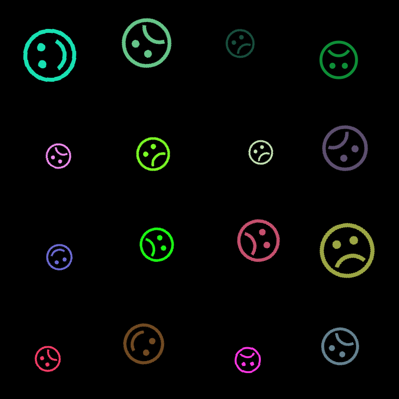

# thecatch-happy-captcha
My solution to Happy Captcha CTF (thecatch.cz) 2018 written in Python using Flask and bit of JS

## About
CTF challenge Happy Captcha from [thecatch.cz](http://www.thecatch.cz) 2018. Written using python3, Flask and bit of JS map magic.
You got image with 16 smileys, to get flag you have to read RGB values of smiling ones (always 3 ) XOR them together and send back the response within 5 seconds. (Also add phpsessid cookie from the first request.)

## Warning
This code was written in fast manner, it's purpouse was to work, not to look (good).

## Notes
I think the JS map part is somewhat overdone for quick solution.
I didn't want to implement some kind of machine recognition. You fire up the flask, open localhost:5000, recognize & select the smiling ones by yourself, after selecting third frontend sends the data back to flask to do the RGB & xoring part.
